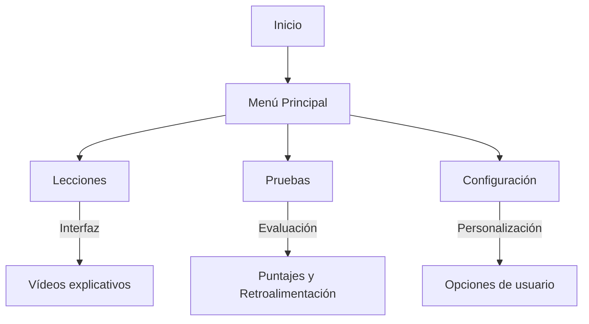

# Proyecto APP de Lengua de Signos Española


# 🎯 Aprendizaje de Lengua de Signos en Android

## ✨ Introducción

📢 Bienvenidos a **Aprendizaje de Lengua de Signos**, una aplicación móvil diseñada para facilitar el aprendizaje y práctica de la lengua de signos de manera interactiva y accesible. 

El aprendizaje de la lengua de signos es esencial para la inclusión y accesibilidad. A través de nuestra aplicación, los usuarios pueden aprender paso a paso mediante módulos interactivos, vídeos explicativos y evaluaciones dinámicas. Todo esto con un diseño intuitivo y accesible para garantizar que cualquier persona, sin importar su nivel previo, pueda utilizarla de forma eficiente. 🚀

## 🌟 Características principales

✅ **Lecciones interactivas** con vídeos y ejemplos.  
✅ **Pruebas de conocimiento** para evaluar el progreso del usuario.  
✅ **Diseño accesible e intuitivo** para facilitar el aprendizaje.  
✅ **Integración con Firebase** para autenticación y almacenamiento de datos.  
✅ **Notificaciones personalizadas** para recordatorios y seguimiento del aprendizaje.  

## 🛠️ Tecnologías utilizadas


## 📷 Capturas de pantalla

Todavia no hay...

## 🏗️ Arquitectura del proyecto



## 📥 Instalación y configuración

### 🔹 Requisitos previos

🔹 Android Studio instalado en tu computadora.  
🔹 Un dispositivo Android o un emulador configurado.  
🔹 Acceso a una cuenta de Firebase.  
🔹 SDK de Android actualizado.  

### 🚀 Pasos de instalación

```bash
# Clonar el repositorio
git clone https://github.com/usuario/proyecto-lengua-signos.git

# Abrir en Android Studio y ejecutar en un emulador o dispositivo físico
cd proyecto-lengua-signos
```

### 🔧 Configuración de Firebase

1️⃣ Accede a [Firebase Console](https://console.firebase.google.com/) y crea un nuevo proyecto.  
2️⃣ Agrega una nueva aplicación Android utilizando el paquete de tu aplicación.  
3️⃣ Descarga el archivo `google-services.json` y colócalo en el directorio `app/`.  
4️⃣ Habilita Firebase Authentication y Firestore en la consola de Firebase.  
5️⃣ Configura las reglas de seguridad según las necesidades del proyecto.  

## 📖 Uso de la aplicación

1️⃣ **Registro e inicio de sesión:** Los usuarios pueden registrarse con su correo electrónico o iniciar sesión con Google.  
2️⃣ **Explorar lecciones:** Accede a módulos con contenido didáctico y vídeos demostrativos.  
3️⃣ **Pruebas interactivas:** Completa pruebas para reforzar conocimientos adquiridos.  
4️⃣ **Seguimiento del progreso:** Consulta estadísticas y avances en el perfil del usuario.  

## 👥 Contribuidores

👨‍💻 **Luis Garcia Lizandra ** - [GitHub](https://github.com/LuisGarciaLizandra)  
👩‍💻 **Mi ayudante 1** - [GitHub](https://github.com/Ayudante1)  
👨‍💻 **Mi ayudante 2** - [GitHub](https://github.com/Ayudante2)  

## 📄 Licencia

Este proyecto está bajo la licencia MIT. Consulta el archivo [LICENSE](LICENSE) para más información.  

## 🎉 Agradecimientos

A todas las personas que han colaborado y apoyado este proyecto para hacerlo realidad. 🙌  

## 📢 Contacto

📧 **Email:** contacto@proyecto-lenguadesignos.com  
💬 **Discord:** [Servidor de la comunidad](https://discord.gg/ProyectoSignos)  
🐦 **Twitter:** [@ProyectoSignos](https://twitter.com/ProyectoSignos)  

🚀 ¡Esperamos que disfrutes aprendiendo con nuestra aplicación! 🚀


